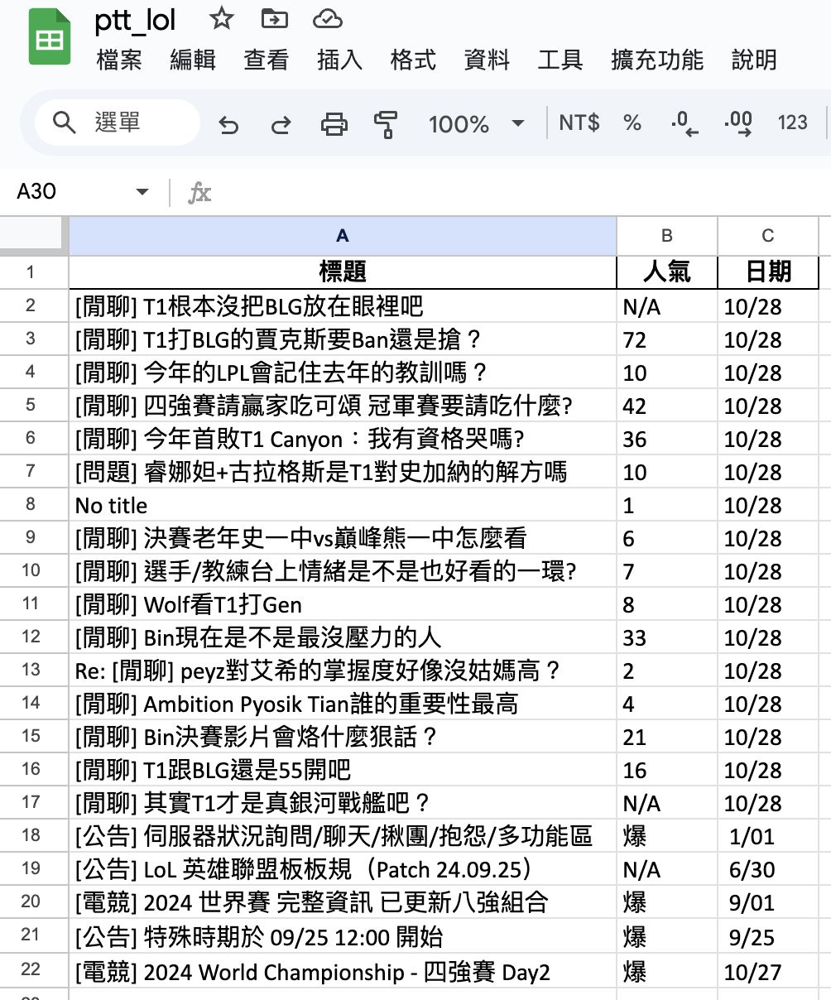

# PTT_LOL_Crawler

### 使用 Python 爬取 PTT LOL 版資料並轉成 JSON 以及 Excel 格式

### 套件使用: BeautifulSoup、Pandas

## 執行

### 進入虛擬環境

`poetry shell`

### 安裝相關套件

`poetry install`

---

### HTML 格式

### Json 格式

### Excel 格式

